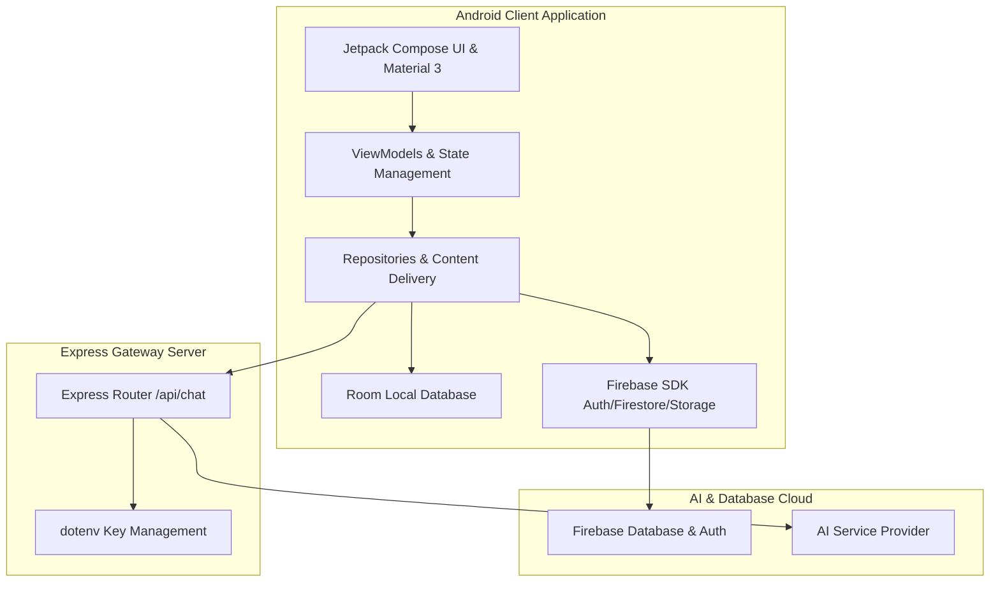

# Nyaya Legal AI ⚖️🤖

Nyaya Legal AI is a comprehensive legal assistant and learning platform designed to make Indian law accessible, clear, and action-oriented. Powered by advanced AI models, it bridges the gap between complex legal jargon and daily legal rights.

The project consists of a high-performance **Android mobile application** built using Jetpack Compose and Kotlin, alongside a secure **Node.js Web Backend** that handles secure LLM orchestration.

---

## 🚀 Key Features

*   **💬 AI Legal Chatbot & Assistant**
    *   Dynamic AI problem solver answering legal questions in real-time.
    *   Configured with strict safety guardrails to answer *only* legal, rights-related, and constitutional queries, safely rejecting unrelated topics.
*   **📂 Law Encyclopedia**
    *   Comprehensive index of legal sections, constitutional articles, and legal acts (e.g., IPC, BNS, Constitution of India).
    *   Advanced offline/online search functionality.
*   **🎓 Legal Learning & Scenarios**
    *   Simplifies legal rights and terminology into easy-to-digest educational lessons.
    *   Interactive scenario matcher helping users learn which legal provisions apply to specific real-life issues.
*   **💼 Lawyer Consultation & Directory**
    *   Interactive directory of verified legal professionals.
    *   Search and filter lawyers by name, city, or specialization (Criminal, Civil, Corporate, etc.).
    *   Enables booking management, appointment tracking, and contact options (direct call/email).
*   **🌐 Multi-Language Support**
    *   Bilingual localization, ensuring legal literacy is reachable by a wider demographic.

---

## 🏗️ Project Architecture



### 📱 Android Application
Built using modern Android development principles:
*   **UI Framework**: Jetpack Compose using **Material 3** guidelines, custom styles, custom layouts, and interactive screens.
*   **Architecture**: MVVM (Model-View-ViewModel) with repository pattern for offline-first support.
*   **Local Caching**: **Room Database** for high-speed offline searches and learning module tracking.
*   **Network Gateway**: **Retrofit** and OkHttp client for server requests.
*   **Media**: Coil-compose for asynchronous image caching and display.

### 🌐 Web Gateway Server
*   **Engine**: Node.js & Express server.
*   **Core Role**: Serves as a secure gateway for LLM requests (using the AI Service Provider).
*   **Security**: Prevents exposing AI api keys on client devices by loading them securely from local properties/environment variables on the server.

---

## 🛠️ Technology Stack

*   **Language**: Kotlin (for Android), JavaScript / ES6 (for backend node app)
*   **State Management**: StateFlow, LiveData, and ViewModels
*   **Database**: Room DB, SQLite, Firebase Firestore
*   **Authentication**: Firebase Authentication
*   **Cloud Storage**: Firebase Storage
*   **AI Integration**: AI Service Provider (e.g., Groq / Gemini APIs)

---

## 🔒 Security & Key Configuration

This project enforces strict security standards. **Never commit actual API keys or credential files (like `google-services.json` or keystores) to version control.**

All API keys are loaded locally from `local.properties` (which is excluded in `.gitignore`):

### 📝 Configuring API Keys Locally
Create a file named `local.properties` in the root folder of the project, and add your API keys:

```properties
# Firebase / Android Studio SDK will read this automatically during build
GEMINI_API_KEY=your_gemini_api_key_here
GEMINI_ASSISTANT_API_KEY=your_gemini_assistant_api_key_here
GROQ_LEARNING_API_KEY=gsk_your_groq_learning_key_here
GROQ_ASSISTANT_API_KEY=gsk_your_groq_assistant_key_here
```

During build, the Gradle script dynamically loads these keys and exposes them in `BuildConfig` variables (`BuildConfig.GROQ_ASSISTANT_API_KEY`, etc.), keeping the credentials hidden from Git.

---

## 🏁 Getting Started

### Prerequisites
*   Android Studio Koala / Ladybug or later
*   JDK 17 or 21 configured
*   Node.js (v18+) and npm installed
*   A Firebase project created in the console

### Step-by-Step Setup

1.  **Clone the Repository**
    ```bash
    git clone https://github.com/Manikumarreddy4/Nyaya-Legal-AI.git
    cd Nyaya-Legal-AI
    ```

2.  **Add Firebase Configuration**
    *   Download your `google-services.json` from your Firebase project.
    *   Place it in the `app/` directory (`app/google-services.json`).

3.  **Configure local keys**
    *   Create a `local.properties` file in the root directory.
    *   Paste the keys described in the **Security & Key Configuration** section above.

4.  **Run the Backend Gateway Server**
    ```bash
    cd webapp
    npm install
    # Start the server on port 5000
    node server.js
    ```

5.  **Compile and Run Android App**
    *   Open the root directory in Android Studio.
    *   Let Gradle sync finish.
    *   Click **Run** to launch the app on your emulator or physical test device.
